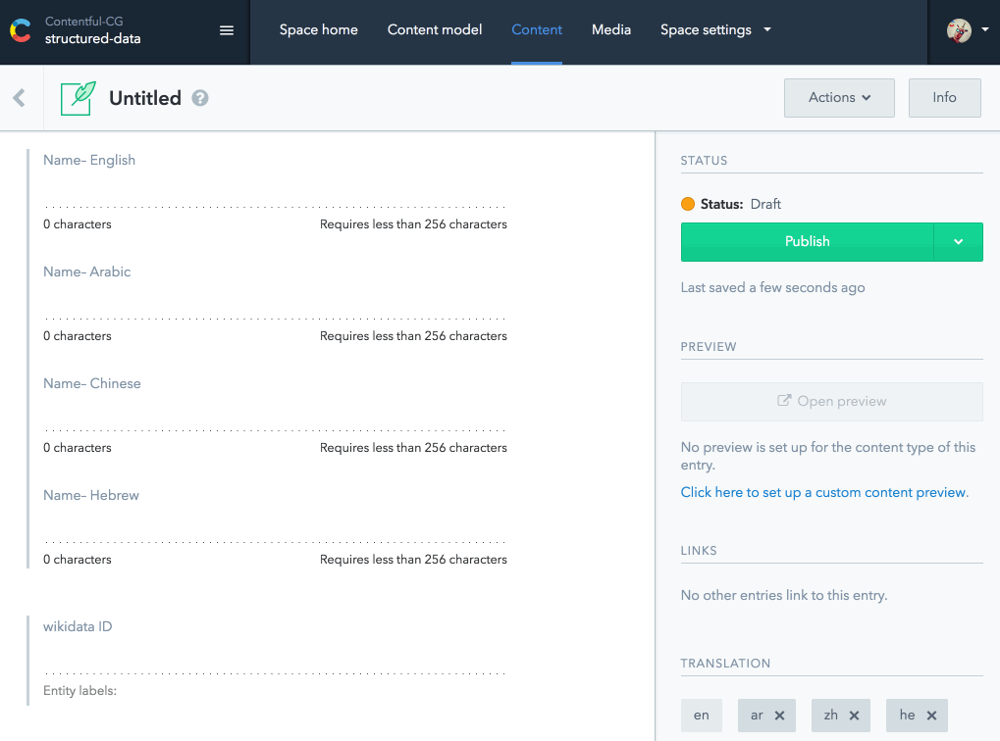

# Contentful UI Extension with wikidata.org

Fetches an entity from Wikidata and will try to update a name field in all available locales.



Uses <https://github.com/contentful/ui-extensions-sdk> and borrows some pieces from <https://github.com/contentful/extensions>.

More about extensions can be read at [Contentful / Docs / Concepts / UI Extensions](https://www.contentful.com/developers/docs/concepts/uiextensions/).

## Setup/Installation

```sh
# install dependencies and tools (requires yarn)
make prepare

# Builds the extension
make build

# Creates the extension in Contentful (needs to be done only once the first time)
make create

# Updates the extension (after you have changed and rebuilt it)
make update
make update-force
```
